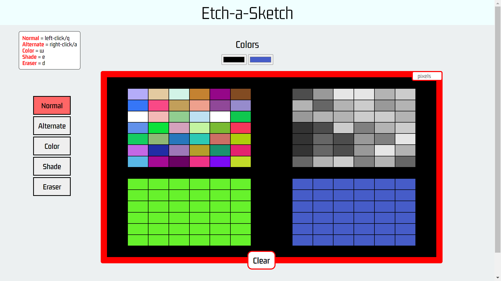
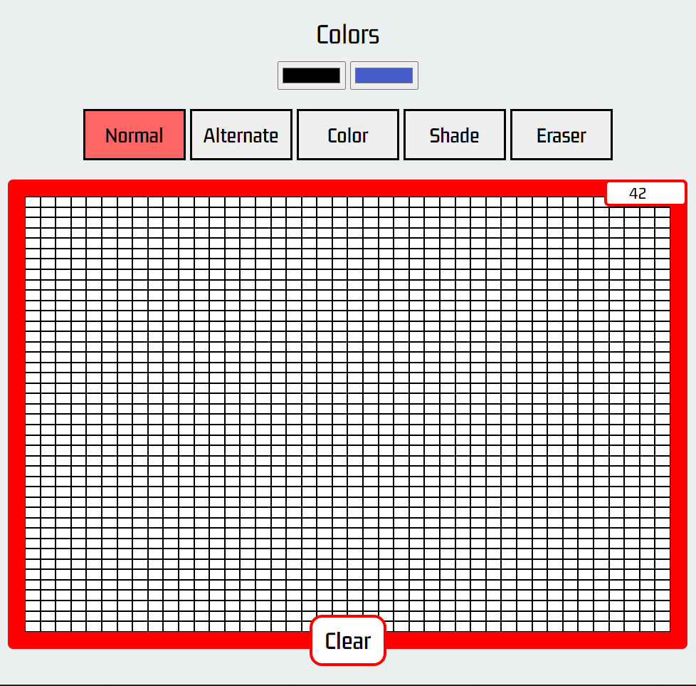

# PixelSketch

## Screenshots

</img> 
</img>

## Description

A JavaScript application based on the Odin Project exercise - **'Etch-a-Sketch'**

**Features:**

- Modern User Interface
- Keyboard Support
- Duo-Pen (+ Mouse Support)

## What I've Learnt

- Advanced DOM manipulation
- Handling mouse events
- Using data-attributes to store data

## Installation

To use this project, first clone the repo on your device using the command below:

`git init`

`https://github.com/tarwat-uddin/pixelsketch.git`

## License

[GNU General Public License version 3](https://opensource.org/licenses/GPL-3.0)
